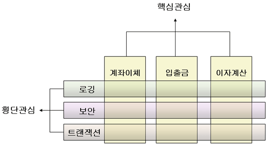

### 🔎 데코레이터

✓ 타입스크립트에서 지원하는 기능으로 class를 수정하지 않고, class 멤버의 정의를 수정하거나 기능을 확장할 수 있도록 하는 구조적 패턴

(컴파일, 런타임 실행 유형에 차이는 있을 수 있지만 **자바의 어노테이션/파이썬의 데코레이터**와 유사)

✓ 데코레이터 패턴: 메타 프로그래밍 방식이라고도 불리며 동작을 포함하는 특수 래퍼(wrapper) 객체 안에 객체를 배치해서 객체에 새 동작을 추가할 수 있는 구조적 디자인 패턴

✓ 클래스가 정의되거나 내부 함수 등이 호출될 때마다 실행할 코드를 셋업

✓ 코드 실행(런타임)과정에서 지정된 데코레이터 함수가 실행되는 개념이다

✓ 이를 통해 횡단 관심사(cross-cutting concern)을 분리하여 `관점 지향 프로그래밍(AOP)`을 적용한 코드를 작성할 수 있다.

- 클래스 선언, 클래스 내부 메서드(method) / 접근자(accessor), 프로퍼티(property) / 매개변수(parameter) 에만 지정 가능
- 데코레이터 함수에는 일반적으로 target, key, descriptor가 전달되며, 어떤 멤버를 데코레이터 했느냐에 따라 달라질 수 있다.
- 데코레이터는 메소드나 클래스 인스턴스가 실행(만들어)되는 런타임에 실행된다 (매번 실행 X)

#### 💡 종류

- class Decorator
- Property Decorator
- method Decorator
- Accessor Decorator
- Property Decorator

#### 💡 컴파일 옵션

해당 기능을 사용하기 위해서는 `tsconfig.json`에서 타입스크립트 컴파일 옵션을 지정해 주어야 한다

```json
{
  "compilerOptions": {
    ...
    "experimentalDecorators": true,
    ...
  }
}
```

NestJs에서 컨트롤러 구현 예시

```ts
@Get() // Get 메서드 활용
  @HttpCode(HttpStatus.OK) // HTTP Status Code 200번 return
  @LogEnabled() // 로깅 모듈 (해당 메서드 활용시 Request, Response 값을 로깅하고 저장한다)
  async list(
    @Query() query: SendVehicleListApiRequestControllerQueries, // Request query값
    @Req() request: Request, // HTTP request 값
  ): Promise<SendVehicleListApiRequestControllerResponse> {
    try {
      ...
      // 메인 로직
      ...
```

---

#### 📌 AOP(Aspect Oriented Programming)

OOP를 더욱 발전시키기 위한 개념으로 활용되며 하나의 거대한 OOP로써 설계, 프로그래밍 되어있다면 이것을 각 기능별로 모듈화해서 분리시키는 개념이다.

즉, 핵심 관심사와 로깅, 보안, 트랜잭션과 같은 횡단 관심사를 분리시키는 것이 해당 개념이다.



**핵심 관심**: 각 서비스의 핵심 비즈니스 로직
**횡단 관심**: 공통 모듈(로깅, 보안, 트랜잭션)

=> 즉, 로깅을 위한 코드의 경우 거의 모든 핵심 관심사에서 사용되기 때문에 매 번 작성되면 중복코드가 많아진다.
이를 데코레이터 메서드로 구현에 놓음으로써 중복을 제거하고 가독성을 높일 수 있다.

이를 통해 얻을 수 있는 장점

- 중복 코드 사라짐
- 코드 간결, 유지보수성 높아짐
- 코드 재활용성 높아짐
